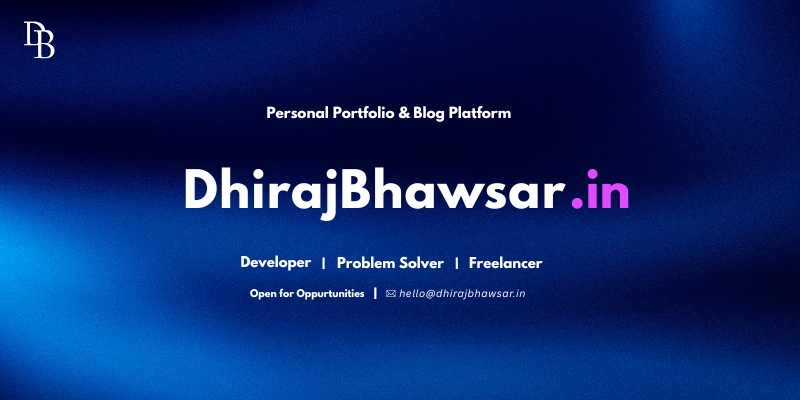

<div align="center">
  
</div>

<br/>

<p align="center">
  
  &nbsp;&nbsp;
  <a href="mailto:hello@dhirajbhawsar.in"></a>
  &nbsp;&nbsp;
  <a href="https://linkedin.com/in/bhawsar-dhiraj"></a>
  &nbsp;&nbsp;
  <a href="https://github.com/dhirajTsx"></a>
  &nbsp;&nbsp;
  <a href="https://dhirajbhawsar.in"></a>
</p>

---

### Engineering products that *scale* & *stick* with time.

<table width="100%" border="0" cellpadding="0" cellspacing="0" style="border: none; border-collapse: collapse;">
  <tr style="border: none;">
    <td width="60%" valign="top" style="border: none; padding-right: 20px;">
      <p>Results-driven Full Stack Developer with proven experience at Rablo.in, specializing in Next.js 14, React.js, TypeScript, and Node.js. Skilled in building scalable, SEO-optimized, and accessible web applications with robust backend integration. Adept at REST API development, authentication systems, database management, and end-to-end performance optimization.</p>
      <ul>
        <li>⚡ Specialized in <b>Next.js, React.js, TypeScript & Node.js</b></li>
        <li>🎓 Pursuing <b>MCA in Software Engineering</b></li>
        <li>🏆 Solved <b>300+ DSA Problems</b></li>
        <li>🧑‍💻 Explore my work at <a href="https://dhirajbhawsar.in">dhirajbhawsar.in</a></li>
      </ul>
    </td>
    <td width="40%" align="right" valign="top" style="border: none;">
      
    </td>
  </tr>
</table>

---

### 💻 Things I code with

<p align="left">
  
</p>

---

### 📊 Weekly development breakdown

<!--START_SECTION:waka-->

```txt
From: 05 June 2026 - To: 12 June 2026

No activity tracked
```

<!--END_SECTION:waka-->
